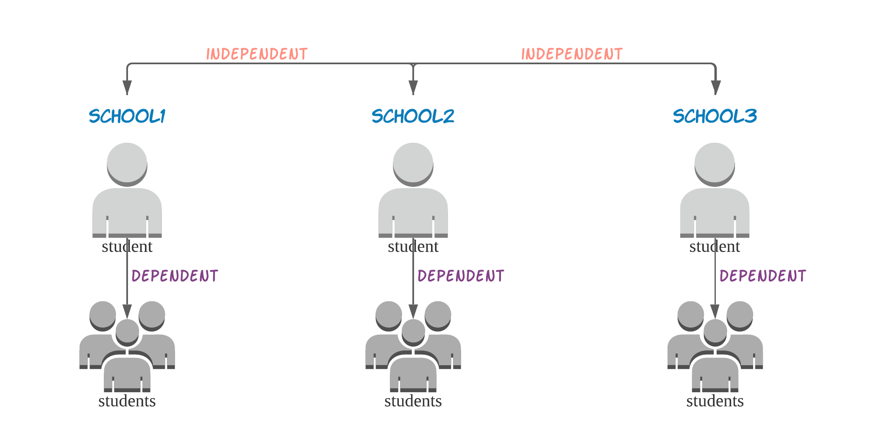

```{r setup, include=FALSE}
options(htmltools.dir.version = FALSE)
library(knitr)
library(kableExtra)
```

```{r xaringan-themer, include=FALSE, warning=FALSE}
library(xaringanthemer)
style_mono_accent(base_color = "#43418A")
```

```{css, echo = FALSE}
.footnote { position: absolute; bottom:0; }
```

## Linear Mixed Model 👩‍💻


---
## Linear Mixed Model(con't)

--
.center[$$\boldsymbol{y = X\beta + Zb + e}$$]

where

.pull-left[
- $\mathbf{y}$ is a $\mathbf{N \times 1}$ vector of observations, outcome variable
- $\mathbf{X}$ is a $\mathbf{N \times p}$ matrix
- $\boldsymbol\beta$ is a $\mathbf{p \times 1}$ vector of the fixed effect
- $\mathbf{Z}$ is a $\mathbf{N \times q}$ matrix
- $\mathbf{b}$ is a $\mathbf{q \times 1}$ vector of the random effect
]

.pull-right[
\begin{align*}
   \begin{bmatrix}
      \mathbf{b} \\ \mathbf{e}
   \end{bmatrix}
   \sim \mathcal{N}\left(\begin{bmatrix}\mathbf{0} \\ \mathbf{0} \end{bmatrix}, \begin{bmatrix} \mathbf{\Gamma} & \mathbf{0} \\ \mathbf{0} & \mathbf{R} \end{bmatrix}\right)
\end{align*}

\begin{align*}
  \mathbf{y} \sim \mathcal{N} (\boldsymbol{X\beta}, \mathbf\Omega = \boldsymbol{Z\Gamma Z^\top + R})
\end{align*}
  ]
  
--

How can we implement the LME?
- `lmer` function from `lme4` package
- `mmer` function from `sommer` package

.footnote[
<br><span style="font-size:8pt">Douglas Bates, Martin Maechler, Ben Bolker, Steve Walker (2015). Fitting Linear Mixed-Effects Models Using lme4. Journal of Statistical Software, 67(1), 1-48. doi:10.18637/jss.v067.i01. <br>Covarrubias-Pazaran G. 2016. Genome assistedprediction of quantitative traits using the R package sommer. PLoS ONE 11(6):1-15.</span>
]

---
background-image: url(hypothesis_test.png)
background-size: contain
class: inverse, center, middle

.footnote[
<span style = "font-size:8pt">Buja, A., Cook, D., Hofmann, H., Lawrence, M., Lee, E.-K., Swayne, D. F., and Wickham, H. (2009), “Statistical Inference for Exploratory Data Analysis and Model Diagnostics,” Royal Society Philosophical Transactions, Series A, 367, 4361–4383.</span>
]
---
background-image: url("plots/sl_mr.png")
background-size: contain
class: inverse, center, middle

---
## Data

--
- Linguistic study case
  - The data contains 84 observations on the voice pitch (or frequency) from 6 subjects (3 females and 3 males) under 7 scenarios with 2 attitudes (informal or polite).

--
- Sleep deprivation study case
  - Average reaction time per day for subjects restricted to 3 hours of sleep per night over 10 days for 180 observations.

--
- Autism study case
  - 155 children between the ages of 2 and 13 who were diagnosed with either autism spectrum disorder or non-spectrum developmental delays at age 2.
      - `childid`: Child ID
      - `sicdegp`: Sequenced Inventory of Communication Development group (an assessment of expressive language development) with levels low, mod, and high
      - `age2`: Age (in years) centred around age 2 (age at diagnosis)
      - `vsae`: Vineland Socialization Age Equivalent
      - `gender`: Child's gender, female and male
      - `race`: Child's race, white and non-white
      - `bestest2`: Diagnosis at age 2, autism and pdd

.footnote[
<span style = "font-size:8pt"> Douglas Bates, Martin Maechler, Ben Bolker, Steve Walker (2015). Fitting Linear Mixed-Effects Models Using lme4. Journal of Statistical Software, 67(1), 1-48. doi:10.18637/jss.v067.i01.
<br>Adam Loy, Heike Hofmann (2014). HLMdiag: A Suite of Diagnostics for Hierarchical Linear Models in R. Journal of Statistical Software, 56(5), 1-28. URL http://www.jstatsoft.org/v56/i05/.</span>
]    
---
# Examlple: 🌑 Sleep deprivation study case

Exploratory Data Analysis(EDA):


- Random intercepts and random slopes for different subjects

☞ Using `lmer` function from `lme4` package to fit the linear mixed model

.footnote[
<span style = "font-size:8pt"> Tukey, J. W. (1977), Exploratory Data Analysis, Boston, MA: Addison-Wesley.</span>]
---
# Methodology
Generate 3 versions for each data set (🔔 replicate each version for 4 times) for 4 plots (Residual plot for marginal residuals $\boldsymbol{\hat\xi = y - X\hat \beta}$ and conditional residuals $\boldsymbol{\hat e = y - X\hat \beta - Z\hat b}$, QQ plot for conditional residuals and least confounded residual $\mathbf{c}_k^\top \hat{\mathbf{e}}$):
.pull-left[
- Simulated from "best" model $\mathbf y^* = \mathbf X \hat{\boldsymbol \beta} + \mathbf Z \mathbf b^* + \mathbf e^*$
- Added some noise to "best" model $\mathbf y^* = \mathbf X \hat{\boldsymbol \beta} + \mathbf Z \mathbf b^* + \mathbf e^* + \text{noise}$
  - Linguistic study case: with error term that follows a student t distribution
  - Sleep deprivation study case: added the within unit correlation in the error term by value 25, that is for first 10th observations' error terms are correlated.
  - Autism study case: with error term that follows a student t distribution
  
where $\mathbf b^* \sim \mathcal{N}(\mathbf 0,\hat{\mathbf G})$ and $\mathbf e^* \sim \mathcal{N}(\mathbf 0, \hat{\mathbf R})$
]
.pull-right[
- Added extreme noise to "best" model $\mathbf y^* = \mathbf X \hat{\boldsymbol \beta} + \mathbf Z \mathbf b^* + \mathbf e^* + \text{extreme noise}$
  - Linguistic study case: randomly added 20% of average value of each categories with gender and attitude (F&Polite, F&Informal, M&Polite and M&Informal) to only one response variable of each  categories.
  - Sleep deprivation study case: randomly added 20% of mean value to 2 response values of each subject.
  - Autism study case: randomly added 20% of the total median values to 20% of observations
]

---
background-image: url(simulation.png)
background-size: contain
class: inverse, center, middle

---
background-image: url(diagram.png)
background-size: contain
class: inverse, center, middle

---
# Survey 📸
.pull-left[We are doing a survey on the shiny app by asking observers' name, gender, age, education level and if they've learnt econometrics or statistics before.
]
.pull-right[
By using the Latin Squared Design, we randomly give each observer 12 different lineups including all 3 data sets with 4 different plot types. The observers are asked the questions "Which Which map is most different from the others?" and  "How certain are you that the chosen map is different?".

]


.footnote[
<span style="font-size: 8pt">Winston Chang, Joe Cheng, JJ Allaire, Yihui Xie
  and Jonathan McPherson (2020). shiny: Web
  Application Framework for R. R package version
  1.5.0. https://CRAN.R-project.org/package=shiny 
  <br>Felipe de Mendiburu (2020). agricolae: Statistical
  Procedures for Agricultural Research. R package
  version 1.3-3.
  https://CRAN.R-project.org/package=agricolae</span>
]
---

class: inverse, center, middle

# Approach and Method

---

class: inverse, center, middle

# Results

```{r}
results <- data.frame(lineups = c("Marginal residual plot", "Condtional residual plot", "QQ plot for conditional residual", "QQ plot for least confounded residual"), version1 = c('0/24', '0/16', '0/19', '1/17'), version2 = c('1/12', '1/16', '0/18', '1/13'), version3 = c('1/15', '10/22', '12/16', '2/21'))
results %>% kable() %>%
  kable_styling("hover", full_width = F)
```

---
class: inverse, center, middle

# Limitations

---
class: inverse, center, middle

# Conclusion

---
class: center, middle

# Thank you

Slides created via the R package [**xaringan**](https://github.com/yihui/xaringan).
