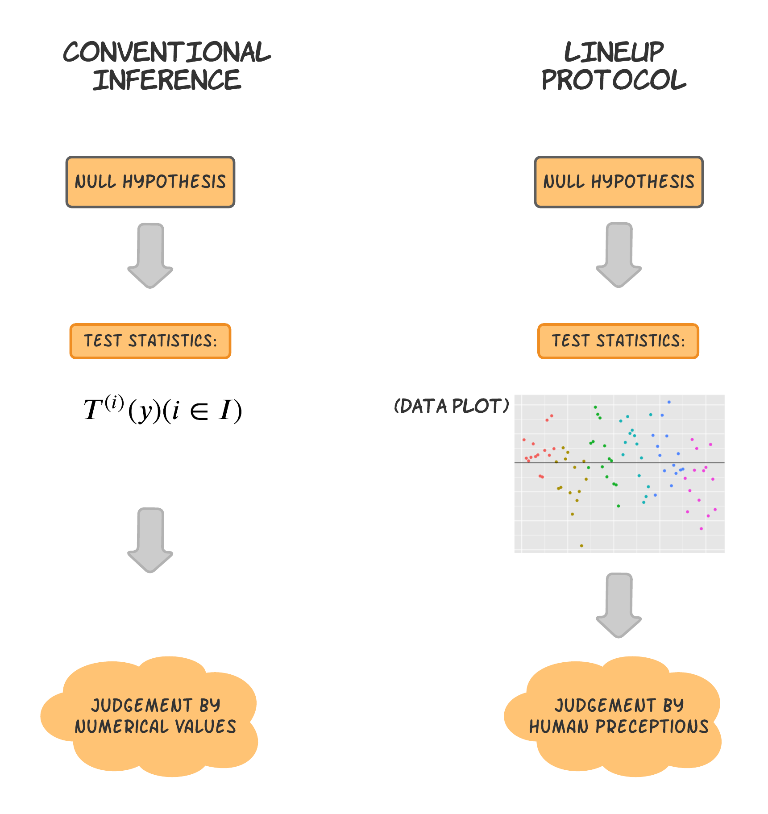

```{r setup_1, include=FALSE}
knitr::opts_chunk$set(echo = FALSE, 
                      message=FALSE, 
                      cache=TRUE,
                      fig.align = "center")
```

# Abstract {-}

Graphical diagnostics focusing on the residual analysis are alternative methods to test the hypotheses based on the simulation approaches such as parametric bootstrap applied in the lineup protocol. We use three different data types, namely categorical, numerical, and mixture of categorical and numerical to accommodate the three different versions of Gaussian linear mixed models. Four diagnostic maps are used to detect the existence of abnormal observations from marginal residuals versus conditional residuals, and to evaluate the normality of conditional errors based on conditional residuals versus confounding conditional residuals. We create a survey to validate the methods. From the result, we find that the conditional residuals are better at checking the presence of outlying observations and exploring whether the conditional errors follow a normal distribution. Furthermore, by comparing those three diverse types of data, the mixture performs better at identifying the data plot among the null plots. R code is provided on GitHub (https://github.com/kaiwenjanet/master).

# Introduction {#ch:intro}

Statistical graphics play an important role in exploratory data analysis, model checking and diagnostic. For residual diagnostics, a plot may be used to infer the appropriateness of the fitted model such as by searching for unusual patterns in the plot. Graphical diagnostics enable the analyst to not only find unexpected results but may also uncover the reason for the result. However, inferences from plots are made often without calibration and in an informal manner, unlike the treatment of hypothesis tests where a numerical test statistic is formulated and compared against certain thresholds (e.g. $p$-value, confidence intervals or Bayes factors). 

In a conventional (frequentist) hypothesis test, we formulate a null and alternate hypothesis, a test statistic and test this test statistic under the null distribution. The visual inference is another tool based on the application of lineup protocol which constitutes of usually, 19 null plots, and one data plot that randomly inserts among the null plots based on the experimental design setup that we created. These lineups are then presented to a number of (possibly independent) observers for evaluation. Figure \@ref(fig:inference) illustrates the conventional and visual inference. The lineup protocol follows closely to that of a frequentist hypothesis test except the data plot is treated as the test statistic. 

```{r inference, out.width="90%", fig.cap="Comparison of visual inference with conventional inference"}

```

Suppose there are $K$ independent observers that participated, the $p$-value for the lineup of size $m$ is calculated as follows [@majumder2013validation]. Consider the null hypothesis ($H_0$) that the data plot is not distinguishable from the null plots and the alternate hypothesis ($H_1$) that the data plot have some difference to the null plot. Assuming that observers have equal perceptive ability and that the positional placement of the plots have no effect then the 
probability that an observer selects the data plot in a lineup of size $m$ is $1/m$ under $H_0$. If we let $X$ be the number of observers out of $K$ total observers who identified the data plot, then $X \sim B(K, 1/m)$ under $H_0$. Suppose $x$ is the observed number of people who identified the data plot, then the visual inference $p$-value is calculated as $P(X\geq x)$. @majumder2013validation also introduces the power of the visual test to compared the robustness of visual inference with the conventional inference.


Linear mixed model is an extension of the linear model, where the model contains additional random effects aside from the error term. The mathematical form of the model is shown in Chapter \@ref(ch:lmm). The diagnostics of linear mixed models are further complicated than that of a linear model as there are considerations of multiple types of residuals. This thesis considers multiple forms of residuals that underlies the constructions of diagnostic plots. Namely, we consider marginal residual, conditional residual and least confounded residual (a linear combination of conditional residuals suggested to perform well) as numerical constructs for the residual plot, boxplot or quantile-quantile (Q-Q) plot. 


The article is organized as follow. Chapter 2 introduce the linear mixed model with algebra. The brief review of the existing literature is illustrated in Chapter 3. Chapter 4 focus on the method we used to generate residual analysis based on three different data types as well as the survey that has been carried out. The results illustrated by the survey is presented in Chapter 5 and discussion and conclusion are in Chapter 6 and Chapter 7 respectively.

<!--This is where you introduce the main ideas of your thesis, and an overview of the context and background.
Later chapters should be divided into coherent pieces describing your analysis. The final chapter should provide some concluding remarks, discussion, ideas for future research, and so on. Appendixes can contain additional material that don't fit into any chapters, but that you want to put on record. For example, additional tables, output, etc.-->
