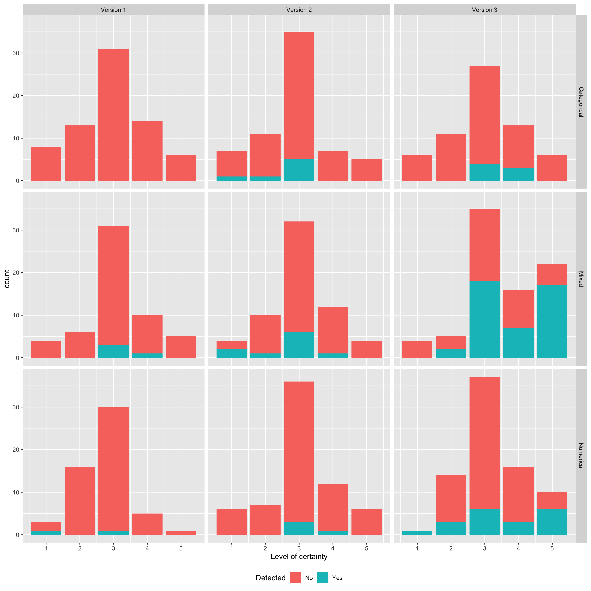

```{r setup, include=FALSE}
knitr::opts_chunk$set(echo = FALSE, message=FALSE, cache=TRUE)
library(cowplot)
library(grid)
library(gridExtra)
library(png)
library(knitr)
library(kableExtra)
library(tibble)
```

# Methodology {#ch:method}

In this section, we introduce three different data sets that represents three different data types (Numerical, Categorical and Mixed). The process of how we generate lineup based on three distinguishable residuals for each data set is going to be explained. As well as the experiment set up of the survey that we published will be illustrated. we use the two-level continuous-response linear mixed model (LMM) whose errors are uncorrelated fitting either by maximum likelihood or restricted maximum likelihood. 
<!-- The model should introduced in Sector 2. -->
$$\mathbf{y} = \mathbf{X} \boldsymbol{\beta} + \mathbf{Zb}+\mathbf{e}$$

<!-- Our object is to find which residual (marginal versus conditional) is better in detecting the presence of outlying observation and which residual (conditional versus confounded) is better in checking the normality assumption. 

since our aim is to detect the residual diagnostics of linear mixed model.
-->

## Data sets

Firstly, there are three data sets that we used in this thesis. They are reaction times in a sleep deprivation study data set in the `R` package `lme4` [@lme4]; Autism study data set in `R` package `HLMdiag` [@HLMdiag]; and Linguistic data set [@winter2013linear]. The linguistic data set contains dependent variables which are categorical. For the sleep study data, it includes all the numerical variables. Besides, the autism data is the combination of numerical and categorical variables.

### Reaction times in a sleep deprivation study

Sleep deprivation and chronic sleep restriction harm health, safety, productivity and quality of the life. In order to better understand the importance of sleep time, @belenky2003patterns did a test based on 66 observers with 3 hours, 5 hours, 7 hours and 9 hours daily time in bed (TIB). The sleep deprivation data set concentrates on the daily time in bed with 3 hours per night with 18 volunteers. On day 0, the subjects had the normal amount of sleep. But for the rest of nine nights, 3 hours of sleep time is restricted to them. The output of 180 records, Reaction, shows the average reaction time per day for each subject. As a result, those volunteers with 3 hour TIB, speed (mean and fastest 10% of responses) on the psychomotor vigilance task (PVT) declined [@belenky2003patterns]. 

### Autism study
<!-- will be replaced with other data set since it takes too much time -->
A prospective longitudinal study following 155 children between the ages of 2 and 13 who were diagnosed with either autism spectrum disorder or non-spectrum developmental delays at age 2 has been carried out by @anderson2009patterns to explore the changes in verbal and social abilities from childhood to adolescence. Assessments were made on the children at ages 2, 3, 5, 9, and 13, however, not all children were assessed at each age. Their age, gender (female or male) and race (white or non-white) were captured. Vineland Socialization Age Equivalent (VSAE) recorded the overall measurement of the child's social skill. Sequenced Inventory of Communication Development (SICD) assessed the expressive language development at aged 2 where three groups have been divided, low, median and high. In addition, The initial diagnostics at age 2 of each child has been written down (autism or pervasive development disorder (pdd)).

### Linguistic study

@winter2013linear introduced a linguistic study case on the vioce pitch by identifying the gender, subjects, scenarios and attitudes. One of the scenarios was asking for a favor respective to different people. For example, one subject was asking professor for a favor which should be in polite attitude, or asking a peer for a favor under a informal condition.
The data contains 84 observations on the voice pitch (or frequency) from 6 subjects (3 females and 3 males) under 7 scenarios with 2 attitudes (informal or polite).

## EDA

_Exploration data analysis_ is a critical tool before fitting the model as this method can help us to identity the features of the raw data. In the sleep deprivation study data, we use the plot comparing the response and explanatory variable of interest using linear smoothers for each group. Fig. \@ref(fig:sleep-eda) illustrates the random intercept and random slope in reaction time versus days from day 0 to day 9 corresponding to different subjects. Hence, we treat the explanatory variable as the designed matrix of fixed effect and the subjects as the designed matrix of random effect. To test the dependency of random effects, based on the method provided by @loy2017model, a scatter plot of predicted random effects with overlaid regression lines. The null plots are simulated from the model whose random effects are not correlated and the data plot is made using the predicted random effects from original model fit to the observed data. While the regression lines show the amount of correlation between random effects. Based on the result, it is hard to distinguish the data plot from null plots although it has a little correlation between random effects. Therefore, there is no need for the correlated random effect, that is the random slope and random intercept are independent.

```{r sleep-eda, fig.height=6, fig.width=6, fig.cap="Exploration Data Analysis example in the sleep study case. It shows the random intercept and random slope with different subjects."}
ggdraw() + draw_plot(rasterGrob(readPNG("figures/sleep_eda.png")))
```


## Residuals Diagnostics

Residuals are used to examine model assumptions and to detect outliers and potentially influential data points.
As @singer2017graphical listed eight uses of residuals for diagnostic purposes, we focus on three residuals with two diagnostic purposes in this thesis: (1) checking presence of outlying observations based on marginal residuals as well as conditional residuals, and (2) detecting normality of conditional error according to conditional residuals and confounded residuals.
After fitting the data sets into "best" model, we can estimate the fixed effect $\hat{\boldsymbol{\beta}}$ and random effect $\hat{\mathbf{b}}$, whereas the variance covariance matrices for random effect and the error term are generated with $\hat{\mathbf{G}}$ and $\hat{\mathbf{R}}$ respectively. Then we apply the method that @singer2017graphical stated to obtain these residuals and then acquire the plots.

Given the true variance of marginal residuals that $\mathbb{V}(\boldsymbol{\hat{\xi}}_i) = \boldsymbol{\Omega}_i - \mathbf{X}_i (\mathbf{X}_i^\top \boldsymbol{\Omega}_i^{-1}\mathbf{X}_i)^{-1}\mathbf{X}_i^\top$, the standardised marginal residuals can be generated as $\boldsymbol{\hat{\xi}}^*_{ij} = \boldsymbol{\hat{\xi}}_{ij}/[diag_j(\mathbb{\hat{V}}(\boldsymbol{\hat{\xi}}_i))]^{1/2}$, where $diag_j(\mathbb{\hat{V}}(\boldsymbol{\hat{\xi}}_i))$ is the $j$-th element of the main diagonal of $\mathbb{V}(\boldsymbol{\hat{\xi}}_i)$. 

With true variance of conditional residuals, $\mathbb{V}(\mathbf{\hat{e}}) = \mathbf{R}[\boldsymbol{\Omega}^{-1} - \boldsymbol{\Omega}^{-1}\mathbf{X}(\mathbf{X}^\top \boldsymbol{\Omega}^{-1}\mathbf{X})^{-1}\mathbf{X}^\top \boldsymbol{\Omega}^{-1}]\mathbf{R} = \mathbf{RQR}$, @singer2017graphical suggested using the standardised conditional residuals, $\mathbf{\hat{e}}_{ij}^* = \mathbf{\hat{e}}_{ij}/diag_{ij}(\mathbf{\hat{R} \hat{Q} \hat{R}})$, where $diag_{ij}(\mathbf{\hat{R} \hat{Q} \hat{R}})$ representing the main diagonal element of $\mathbf{RQR}$ corresponding to the $j$-th observation of the $i$-th unit.

To detect outlying observations, we draw the element of the standardised marginal or conditional residuals versus the observation indices recommended by @singer2017graphical.
However, boxplot is applied for $\boldsymbol{\hat{\xi}}^*_{ij}$ or $\mathbf{\hat{e}}_{ij}^*$ versus the explanatory variables for the autism data set since the data size is big.

@hilden1995multilevel introduced a linear transformation of the conditional residuals which is called least confounded conditional residuals $c_k^\top \mathbf{\hat{e}}^*$ in order to minimise the fraction of confounding. They thought the ability to check for normality of the conditional errors increases. Hence, we employ QQ plot of the standardised conditional residuals and standardised least confounded conditional residuals to check for normality. Whereas @pinheiro2006mixed considers QQ plot of $\hat{\mathbf{e}}/\hat{\sigma}$ for checking the normality of the conditional error, we stick with the method of generating the standardised conditional residuals with Singer, Rocha, and Nobre.

## Experiment setup

On the basis of the data types that we have, three different versions are generated for each data type with four replicates:

<!-- Each data set are generated by three different versions with four replications. It constitutes 12 data plots in each data set with 2 different plot types, one for detecting outlying observations and another for checking normality. After fitting to the 'best' model from the raw data, we generate three different scenarios: -->

<!-- aim for 3 different cases is that: case 1 is hard to be distinguished, case 2 can be identified, case 3 is easily identified.-->

1. *Generated from the "best" model*: 
  
  The estimated random effect and error term are following a normal distribution with mean $\mathbf{0}$ and variance $\hat{\boldsymbol{\Gamma}}$ and $\hat{\mathbf{R}}$ respectively from the "best" model as well as the estimated fixed effect. The sample can be generated through $\mathbf{y}^* \sim \mathcal(\mathbf{X}\hat{\boldsymbol{\beta}}, \hat{\boldsymbol{\Omega}})$ where $\hat{\boldsymbol{\Omega}} = \mathbf{Z}\hat{\boldsymbol{\Gamma}}\mathbf{Z}' + \hat{\mathbf{R}}$.
  <!-- Linear mixed model is generated as $y = X\beta +Zb + e$ where random effect ($b$) and error term ($e$) follow a normal distribution with mean 0 and variance $G$ and $R$ respectively. Fixed effect can be obtained from the model. Hence, a new response variable is generated. -->

2. *Added slight noises*:

  i) For sleep study case, within-unit correlated error terms have been introduced. For each subject, the error terms are correlated by value 25 which is round the standard deviation of the error term.
  ii) For linguistic case, we treat the error term under the $t$-distribution with $\nu = 1$ degree of freedom.
  iii) For autism case, we also treat the error term under the $t$-distribution with $\nu = 15$ degree of freedom at a random choice.

3. *Introduce extreme noises*:

  We randomly added some extreme values to response variable for particular subjects in each data set.
  
  i) For sleep study case, we randomly add 20% of mean value to 2 response values of each subject.
  ii) For linguistic case, we firstly create four tables with respect to the category of gender and attitude, that is female with polite attitude, female with informal attitude, male with polite attitude, and male with informal attitude. Then we alter 4 reaction time value in each table by adding 20% of mean value for the overall reaction time.
  iii) For autism case, we add 20% of the total median response values to roughly 20% of observations at random.

Therefore, 12 data sets are generated with corresponding 12 data plots constituting the residual plots for detecting the presence of outlying and checking the normality of conditional error.

<!--12 data plots are formed within each data type, where half of them are to check the normality and the others are to explore the outlying observations.-->

## Generating lineups

We use the parametric bootstrap method which is illustrated below to generate the null data. The null data are created based on 3 different versions for each rather than the raw data set.

1. We generate the vector of random effects from $\mathcal{N}(\mathbf{0}, \hat{\mathbf{G}})$ for each group, that is, generate $\mathbf{b}^*_i \sim \mathcal{N}(\mathbf{0}, \hat{\mathbf{G}})$ for $i = 1, 2, ..., n$
2. Vector of conditional residuals is generated from $\mathcal{N}(\mathbf{0}, \hat{\mathbf{R}})$ for each group, that is, generate $\mathbf{e}^*_i \sim \mathcal{N}(\mathbf{0}, \hat{\mathbf{R}})$ for $i = 1, 2, ..., n$
3. Generate a bootstrap sample $\mathbf{y}^*_i$ from $\mathbf{y}_i = \mathbf{X}_i \hat{\boldsymbol{\beta}} + \mathbf{Z}_i \mathbf{b}^*_i + \mathbf{e}^*_i$ for each group $i = 1, 2, ...,n$
4. Refit the model to the bootstrap sample.
5. Repeat steps from 1 to 4 by 19 times.

From the null data, the null plots are produced which is consistent with the null hypothesis. Afterwards, we insert the data plot among 19 null plots to form the lineup protocol using the `nullabor` package from @nullabor. We design the position of each data plot. According to Fig. \@ref(fig:design), based on the "best" model, the data plots which point the presence of outlying observations of both marginal or conditional residuals are at the position 7 in the lineup for the first two replicates. Then, for replicates 3 and 4, the position of data plot is 13. The data plot which refers to check the normality of conditional error for either standardised conditional residual or least confounded conditional residual is in panel 9 of 20 plots as the basis of the first two replicates of first version. The position for next two replicates are in 4. The location of the data plot for the remainder two versions are followed the Fig. \@ref(fig:design).

```{r design, fig.height= 4,fig.width=6, fig.cap="Experimental design diagram",results='asis'}
ggdraw() + draw_plot(rasterGrob(readPNG(("figures/diagram.png"))))
```

<!-- we use the experiment design -->

## Survey through Shiny app

We download all the lineups to png files with first three letter for the data types (aut, lin and slp), followed by versions (1, 2, and 3) with replicates (1, 2, 3, and 4). The diagnostic purposes are listed as the last letter where 1 for residual plots in marginal residuals, 2 represents the residual plots in conditional residuals, 3 stands for QQ plot under conditional residuals and 4 signals the QQ plot in confounded conditional residuals.
Using the Latin Squared Design method [@agricolae], we list the replicates 1 to 4 as the rows and four types of diagnostic plots are the column. A, B, C and D as the variates are listed in each cell without repeating in each row and column. Once the cell in the first row has been target, the corresponding row and column will be removed. And the matching diagnostic plot with version 1 will be presented to the observers for particular data type. This process will be iterated 4 times for each data type until we achieve the 12 lineups among 144 lineups for each individual.
These lineups are from 3 different data types with four diverse replicates for 2 different plot types but without restricting the versions. 

We use the `taipan` package (@taipan) to build our survey questions which include the demographic of audience and their responses. Volunteer's name, gender, age, education level and whether they have studied econometrics or statistics are recorded. In the next tab, they are asked to choose the most different map from their decision and how certainty they are to choose that map. There is a process hit for them as the number of lineups they have been seen. They will iterate the process by 12 times by answering the same question but looking at different lineups. If their answers are less than 12 plots before submitting, there will be a hit popped up to reminder them to complete the survey before they leave. After they click the submit button, the final tab is shown up as the thank you page. All the responses made by each individual are securely stored into the google sheet based on the private link through `googlesheets4` package (@googlesheets4) with authenticating. Besides, we also acquire the unique identifier for them in case they double submitted. It is also useful when participant does not leave their names. The plot name with data type, version, replicates and plot type is also recorded which will be used in the further analysis. The time period that the participant takes are displayed as the reference.

# Results {#ch:result}

There are 54 individuals that attempt the survey. While, we removed two tests, people who are not sincerely doing the survey such that they responded all the lineups with the same choice or they just answered several questions. Therefore, we accepted the responses from 50 valid independent individuals with 600 observations.

Among 50 independent observers, 72% of them are female and the rest are male. 
All most half of the participants are aged at 18 to 24 years old and second big proportion is followed by the age range from 25 to 34. There are 18 viewers who achieved Bachelor degree while 20 of them had the Master degree and 8 got the Doctorate degree. Besides, 90% of them have studied econometrics or statistics before.

Based on the responses we got, we calculated the correctness from all these 50 observers. Table \@ref(tab:table) presents the summary of all lineups in evaluation. Three different data types (categorical, numerical and mixed) are combined in the result. We included four different purposes of lineups, where first two are detecting the outlying observation and the last two are checking the normality of the conditional errors and three different versions respectively. The ratio shown in the table is the division of number of observers who identifies the actual data plot among the total number of those who participated in the same version and lineup. The visual $p$-value is calculated based on the method provided by @majumder2013validation.
There are only few observers who are able to identify the actual data plot in the version 1 no matter what types of lineups. It is consistent with our expectations because the version 1 is simulated from the 'best' model which does not have any obvious features. 
While, from the result, increase in the ratio for the version 2 compared with version 1 may indicates that for version 2, the data plot has some features compared with the null plots. 9 out of 48 observers chose the data plot in the QQ plot for assessing the normality of conditional errors based on the standardised conditional residual, which result in a visual $p$-value of 0.00055. This leads us to reject the null hypothesis indicating overall, the conditional error does not follow a normal distribution.
The version 3 performed best among these three versions since it got the most proportion that observers were able to point out the data plot among 19 null plots. The $p$-value of lineup are significant which is shown from all the results shown in the version 3, that is we are able to reject the null hypotheses.
By comparing the ratio, we find that the standardised conditional stand out in checking the outlying observations than the standardised marginal residuals does. As 21 out of 55 viewers are able to identify the actual data plot in the residual plot for conditional residual while there are only 12 out of 58 participants under the marginal residuals. The result shown is on our expectation, because the conditional residuals squeeze the points which shows less information about the pattern but with more outstanding outlying observations. However, using the QQ plot to explore the normality of conditional errors, the standardised conditional residuals perform better than the least confounded conditional residual, which is surprised.
<!-- table need to be fixed.. ugly -->

```{r table, echo=FALSE}
tribble(~Linups, ~'Version 1', ~'Version 2', ~'Version 3',
        "Marginal residual plot", '1/48', '3/44', '12/58 ***',
        "Condtional residual plot", '0/42', '4/53', '21/55 ***',
        "QQ plot for conditional residual", '3/49', '9/48 **', '26/53 ***',
        "QQ plot for confounded residual", '2/44', '5/49 .', '11/57 ***') %>% 
  kable(caption = "Overview of all lineup evaluations") %>% 
  footnote(general = "Signif. codes: $0 \\leq *** \\leq 0.001 \\leq ** \\leq 0.01 \\leq * \\leq 0.05 \\leq . \\leq 0.1 \\leq ' ' \\leq 1$") %>% 
  kable_styling(bootstrap_options = c("bordered", "striped", "hover"))
```

Furthermore, we want to identify if the position of the data plot matters in Table \@ref(tab:position). We only consider the cases from version 2 and version 3 since they have more correct responses compared with version 1. The "1" means that the first two replicates, and "2" represents the last two replicates. Since the lineups are generated as 4 rows and 5 columns by label 1 to 20 from left to right. The residual plot in version 2, the data plot is located at 5 for first and second replicates while at 15 for the rest two replicates. For the version 2 in QQ plot, the data plot is allocated at 8 and 20 respectively. From the result, we can imply that if the data plot is at the corner, then it seems to be easier to be identified. Besides, if the data plot on the first row, it will be picked out quicker for example in the version 3. The data plot of the residual plots is in 15 and 2 respectively. And 11 and 6 are the two positions that apply in the QQ plot for version 3.
<!-- this result may got less evidence.. -->

```{r position}
tribble(~Lineups, ~V2.1, ~V2.2, ~V3.1, ~V3.2,
        "Marginal residual plot", "3/25", "0/19", "4/28 *", "8/30 ***",
        "Condtional residual plot", "3/29", "1/24", "9/26 ***", "12/29 ***",
        "QQ plot for conditional residual", "2/23", "7/25 ***", "15/29 ***", "11/24 ***",
        "QQ plot for confounded residual", "2/29", "3/20 .", "4/30 .", "7/27 ***") %>%
  kable(caption = "Summary table of position for lineup") %>%
  footnote(general = "Signif. codes: $0 \\leq *** \\leq 0.001 \\leq ** \\leq 0.01 \\leq * \\leq 0.05 \\leq . \\leq 0.1 \\leq ' ' \\leq 1$") %>% 
  kable_styling(bootstrap_options = c("bordered", "striped", "hover"))
```

Based on version 3, the data type may also affect the results. As there are three data sets that have been used in this project, that is Autism case, Sleep study case, and Linguistic case. Each data set represents a particular data type, where linguistic case is the representative of categorical data type, numerical data type belongs to sleep study case and the rest, autism is the mixed data type. From the Table \@ref(tab:data-type), it shows that the mixed data type behaves well than the others, as the observers are able to recognize the data plot at the most proportion. Nevertheless, the categorical data types perform least as there are few people point out the actual data plot even in the version 3. In addition, among the mixed data type, it is better to use the standardised conditional residual to detect the outlying observations than based on the standardised marginal residual. Otherwise, the QQ plot applied in least confounded conditional residuals for conditional error model checking is harder to identify the data plot compared with standardised conditional residuals.

```{r data-type}
tribble(~"Lineups", ~"Categorical", ~"Numerical", ~"Mixed",
        "Marginal residual plot", "2/19", "2/21", "8/18 ***",
        "Condtional residual plot", "4/19 *", "3/19 .", "14/17 ***",
        "QQ plot for conditional residual", "0/11", "12/21 ***", "14/21 ***",
        "QQ plot for confounded residual", "1/14", "2/17 .", "8/26 ***") %>%
  kable(caption = "Summary table of position for lineup") %>%
  footnote(general = "Signif. codes: $0 \\leq *** \\leq 0.001 \\leq ** \\leq 0.01 \\leq * \\leq 0.05 \\leq . \\leq 0.1 \\leq ' ' \\leq 1$") %>% 
  kable_styling(bootstrap_options = c("bordered", "striped", "hover"))
```
<!-- certainty -->

We asked the independent viewers to record their confidence level when they choose the data that is the most different one. 1 means very uncertain, while 5 expresses very certain. From Fig. \@ref(fig:certainty), it is interesting to find that, for all three versions and data types, the neutral confidence level (3) has the biggest proportion. However, there is a dramatic increase from version 2 to version 3 with more amounts on higher confidence levels. Especially, in mixed data type, more observers are very certain when they make the choices. Furthermore, the correctness rates are rising from version 1 to version 3. Even they are not sure when they read the lineups, the data plot can be told from the null plots. In addition, with the confidence level from neutral above, there is an excellent ratio of identifying the data plot according to the mixed data type, which is followed by the numerical data type.

```{r certainty, out.width="90%", fig.cap="Level of certainty that made by observers when they reading the lineups"}

```
 
<!--plotting conditional residual against predictors or against observation indices performed reasonably well as methods for diagnosing violations of linear mixed model assumptions. -->

# Discussions {#ch:dis}

At this stage, there are some limitations that occurred when we built the survey and some unexpected things happened as well.

There are three data types for three different versions with four replications each, that is 144 lineups in total. If total number of observers is small, the result will become unreliable since some images may have few or even no responses, so we tried to encourage more individuals to join us.
Based on the survey that we created, we did not provide the reference lineup such that the visual ability of the individuals is not tested. It may result in the biases since we included the responses from those who are not well good at visual detecting. If the observers are able to identify the data plot from the reference lineup, their responses will be accepted otherwise, we will remove them.
If we can add the tolerance interval/area for QQ-plots and residual plots, it can give us more benefits on the result since it will be better in reflecting the null distribution for a specific diagnostic feature and improving objectivity for interpreting these plots.
In order to make the images clear for the viewers to read, we made the lineups as big as possible and put the questions on the sub panel side. The observers may lose patience because they need to scroll up and down the pages to see the whole picture of the lineups, make comparisons and answer the questions by repeating the process for 12 times. 
Also, there may some important hits are listed in the last panel of lineup. For some viewers, they will miss the information about the last 4 panels of lineups if they are not carefully reading the maps. 
Moreover, it is not clear for participants to see the text that "Please click the SUBMIT button at the top of the window" on the question panel for the last image. In addition, observers need to cross the whole page to click the SUBMIT button which is at the top right corner whereas the questions are listed at the bottom left. 
Furthermore, the position of the data plot may also matter. Since we designed the location of each data plot among the null plots for each case whereas the position for residual plots are the same as well as the QQ plots.
Adding some words to explain the goal of the questions may improve the responses. Because we did not tell any information about the aim of this project, when the individuals see the residual plots which have been coloured by diverse subjects, they might treat the plots as the cluster plots which means that they were looking for the cluster pattern. 

# Conclusion {#ch:conc}

We have presented the graphical diagnosis using the lineups generated by simulation from the model, particular for the residual plots and QQ plots based on three different type of residuals.
Using residual plot for identifying the outlying observations under the standardised conditional residuals is more efficient than for standardised marginal residuals. Standardised conditional residuals also perform better in diagnosing if the conditional error follows a normal distribution than the least confounded conditional residuals.

Lineup protocol is the alternative tool when we test the hypothesis. Instead of simply rejecting the null hypothesis, lineup also tells why we are rejecting the nulls. However, the graphical diagnostic does not only depend on the simulation methods, design of lineups, but also the observers. Theoretical power of the visual test may be greater than the conventional inference when the power of visual test increases with a large number of observers.
We remove all the contextual information in the lineups in the survey, such as title, axis and labels in order to make sure that observers are purely picking the most different plots among the null plots.

# Acknowledgments

The author would like to thank Dr. Emi Tanaka for weekly meetings with suggestions and comments, Prof. Di Cook providing useful hits and Stephanie Kobakian supports the ideas for experimental setup and shiny app codes. We are thankful for the coding of residuals in the linear mixed model and the lineup structure provided by Adam Loy and Julio M. Singer.

The analysis of the work was completed in R [@team2019r] with the use of the following packages:

- lme4 [@lme4] and HLMdiag [@HLMdiag] were used for model fitting
- nullabor [@nullabor], ggplot2 [@ggplot2], dplyr [@dplyr], tidyverse [@tidyverse] for visualization and data analysis
- png [@png], grid [@grid] provided the image display
