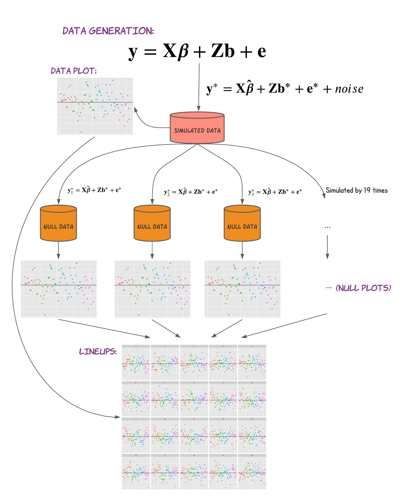

```{r setup_a, include=FALSE}
knitr::opts_chunk$set(echo = FALSE, message=FALSE, cache=TRUE)
library(knitr)
#library(lme4)
#library(sjPlot)
library(kableExtra)
library(tibble)
```

\appendix

# Additional stuff

Data sets that we used in this thesis are described in the following tables (Table \@ref(tab:slp), Table \@ref(tab:aut), and Table \@ref(tab:lin)).
All the code and figures are in the GitHub, https://github.com/kaiwenjanet/master.

```{r slp}
tribble(~Variable, ~Description, ~Min, ~Mean, ~Max,
        "Reaction", "Average reaction time (ms)", "194.3", "298.5", "466.4",
        "Days", "Number of days of sleep deprivation", "0.0", "4.5", "9.0",
        "Subject", "Subject number on which the observation was made", " ", " ", " ") %>% 
  kable(caption = "Description of sleep deprivation study data", booktabs = TRUE)
```


```{r aut}
tribble(~Variable, ~Description,
        "childid", "Child ID", 
        "sicdegp", "Sequenced Inventory of Communication Development group (an assessment of expressive language development) with three factors low (188), median (251) and high (165)",
        "age2", "Age (in years) centered around age 2 (age at diagnosis)",
        "vsae", "Vineland Socialization Age Equivalent as the response variable",
        "gender", "Child's gender with factor male (526) and female (78)",
        "race", "Child's race with white (400) and non-white (204)",
        "bestest2", "Diagnosis at age 2 with autism (389) and pervasive developmental disorder (215)") %>% 
  kable(caption = "Description of autism study data", booktabs = TRUE)
```

```{r lin}
tribble(~Variable, ~Description,
        "subject", "Subject number with female or male",
        "gender", "Individual's gender, female, and male",
        "scenario", "Scenarios that each individual facing, such as aking for a favor",
        "attitude", "Their attitudes with respect to different scenario, polite or informal",
        "frequency", "Voice pitch as the response variable") %>% 
  kable(caption = "Description of linguistic case data", booktabs = TRUE)
```

```{r tabsl}
tribble(~Predictors, ~Estimates, ~CI, ~p,
        "(Intercept)", "251.41", "237.91 – 264.90", "<0.001",
        "Days", "10.47", "7.41 – 13.52", "<0.001",
        "Random Effects", " ", " ", " ",
        "$\\sigma^2$", "653.58", " ", " ",
        "$\\tau_{00}$ Subject", "35.86", " ", " ",
        "$\\tau_{00}$ Subject.1", "627.57"," ", " ",
        "ICC", "0.61", " ", " ",
        "N Subject", "18", " ", " ",
        "Observations", "180", " ", " ",
        "Marginal $R^2$/Conditional $R^2$", "0.352 / 0.747", " ", " "
        ) %>% 
  kable(caption = "Summary of LMM for sleep study", booktabs = T, escape = FALSE) %>% 
  add_header_above(c(" ", "Reaction" = 3)) %>% 
  row_spec(0, italic = T) %>% 
  row_spec(3, bold = T) %>% 
  row_spec(8, hline_after = T)
```

```{r tablin}
tribble(~Predictors, ~Estimates, ~CI, ~p,
        "(Intercept)", "256.77", "225.21 – 288.34",	"<0.001",
        "attitude [pol]",	"-19.58",	"-30.38 – -8.78",	"<0.001",
        "gender [M]",	"-108.37", "-149.56 – -67.19", "<0.001",
        "Random Effects", " ", " ", " ",
        "$\\sigma^2$", "637.84", " ", " ",
        "$\\tau_{00}$ scenario", "216.90", " ", " ",
        "$\\tau_{00}$ subject", "616.77", " ", " ",
        "ICC", "0.57", " ", " ",
        "N subject", "6", " ", " ",
        "N scenario",	"7", " ", " ",
        "Observations", "84", " ", " ",
        "Marginal $R^2$/Conditional $R^2$", "0.676 / 0.860", " ", " "
        ) %>% 
  kable(caption = "Summary of LMM for linguistic study", booktabs = T, escape = FALSE) %>% 
  add_header_above(c(" ", "Reaction" = 3)) %>% 
  row_spec(0, italic = T) %>% 
  row_spec(3, bold = T) %>% 
  row_spec(8, hline_after = T)
```

```{r tabaut}
tribble(~Predictors, ~Estimates, ~CI, ~p,
        "(Intercept)", "7.35",	"4.06 – 10.64",	"<0.001",
        "age2",	"3.80",	"3.09 – 4.51", "<0.001",
        "sicdegp [med]", "1.01", "-0.74 – 2.75", "0.259",
        "sicdegp [high]",	"5.75",	"3.75 – 7.75", "<0.001",
        "bestest2 [pdd]",	"1.95",	"0.39 – 3.52", "0.015",
        "gender [male] : racewhite", "-0.18",	"-3.48 – 3.13",	"0.917",
        "gender [female] : racewhite",	"2.24",	"-1.89 – 6.36",	"0.288",
        "gender [male] : racenonwhite",	"-0.22", "-3.65 – 3.21", "0.901",
        "Random Effects", " ", " ", " ",
        "$\\sigma^2$", "39.16", " ", " ",
        "$\\tau_{00}$ childid", "12.77", " ", " ",
        "$\\tau_{00}$ childid.1", "0.12", " ", " ",
        "ICC", "0.91", " ", " ",
        "N childid", "155", " ", " ",
        "Observations", "604", " ", " ",
        "Marginal $R^2$/Conditional $R^2$", "0.359 / 0.941", " ", " "
        ) %>% 
  kable(caption = "Summary of LMM for autism study", booktabs = T, escape = FALSE) %>% 
  add_header_above(c(" ", "Reaction" = 3)) %>% 
  row_spec(0, italic = T) %>% 
  row_spec(9, bold = T) %>% 
  row_spec(14, hline_after = T)
```

```{r sim, out.width="90%", fig.cap="Simulation process"}

```


